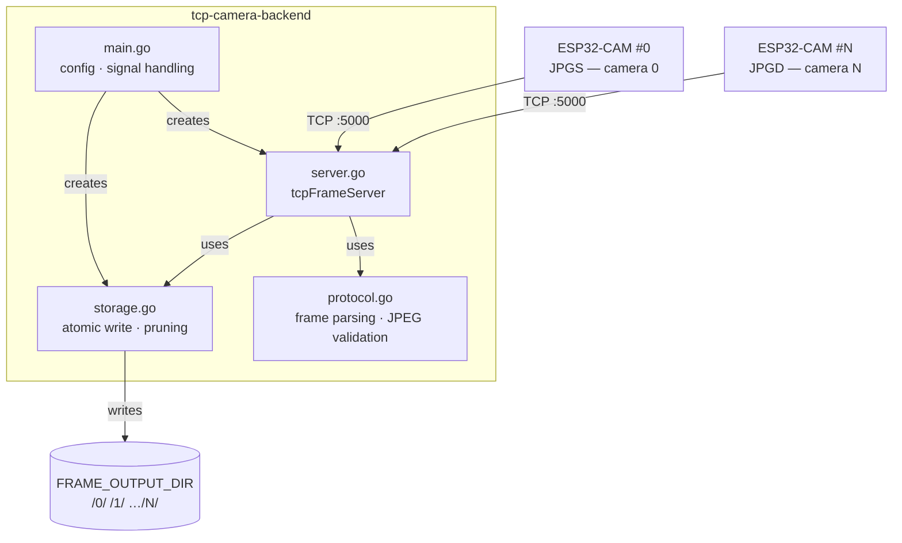
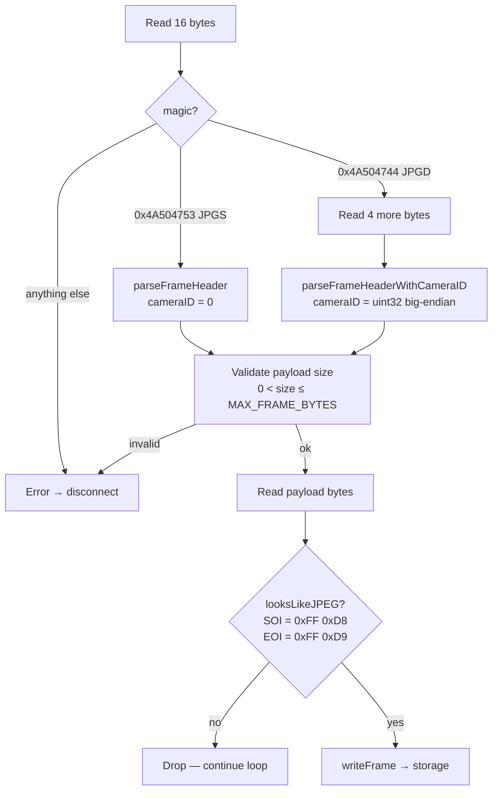
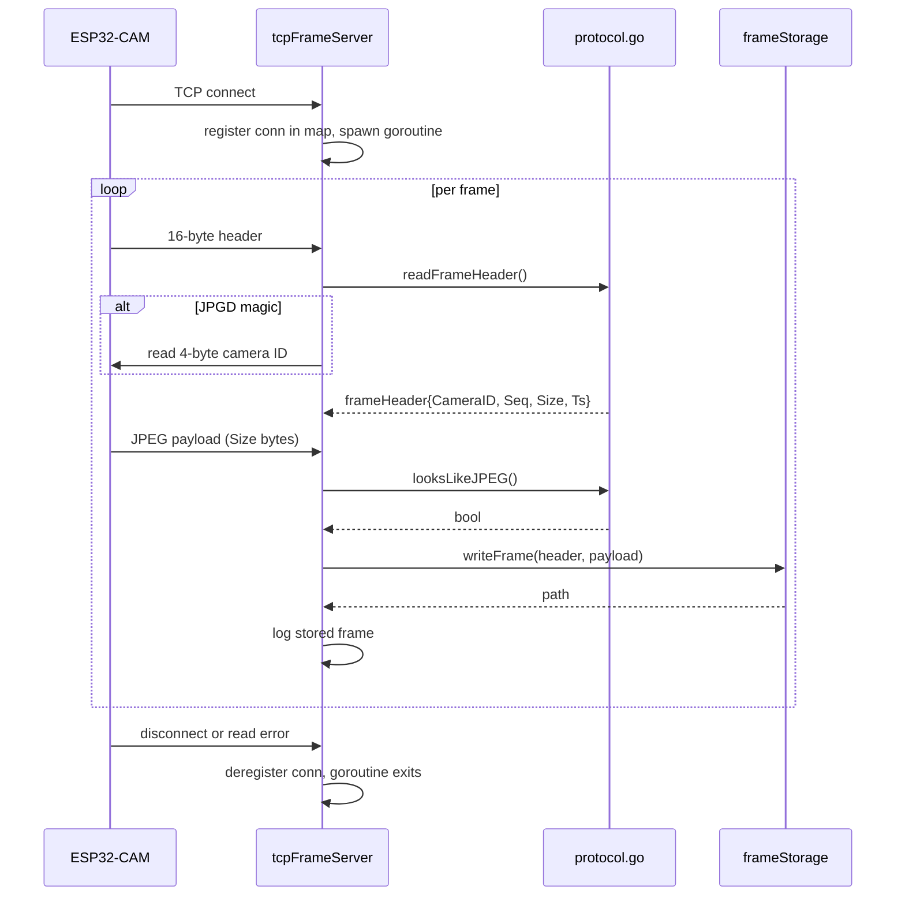
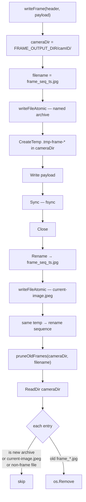
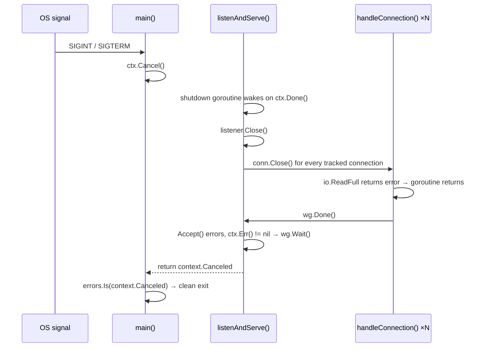

# tcp-camera-backend

Receives JPEG frames from ESP32-CAM devices over a custom binary TCP protocol and writes them atomically to disk.

## Overview

The server accepts raw TCP connections — one per camera or multiple cameras per connection using the JPGD protocol. Each received frame is validated and written atomically to `FRAME_OUTPUT_DIR/<camera-id>/`:

- `frame_<seq>_<ts>.jpg` — named archive file for the current frame
- `current-image.jpeg` — always the latest complete frame (written via atomic rename)

After each write, all previous `frame_*.jpg` files are pruned, keeping exactly one archive file per camera on disk at any time.

## Configuration

All configuration is via environment variables:

| Variable | Default | Description |
|---|---|---|
| `TCP_ADDR` | `0.0.0.0:5000` | Listen address |
| `FRAME_OUTPUT_DIR` | `./frames` | Root directory for frame storage |
| `MAX_FRAME_BYTES` | `5242880` (5 MiB) | Maximum accepted payload size |
| `READ_TIMEOUT` | `30s` | Per-read deadline on each connection |

## Architecture



## Module layout

| File | Responsibility |
|---|---|
| `main.go` | Entry point — reads env config, wires up signal context, creates server and storage |
| `server.go` | TCP listener, per-connection goroutines, frame validation, graceful shutdown |
| `protocol.go` | Binary header parsing for JPGS and JPGD variants, JPEG SOI/EOI check |
| `storage.go` | Atomic file write (temp → sync → rename), `current-image.jpeg` update, old frame pruning |

## Wire protocol

Two frame formats are supported on the same port, distinguished by the first 4 magic bytes.

### JPGS — legacy (single camera, always camera 0)

```
 0       4       8       12      16
 +-------+-------+-------+-------+
 | magic | seq   | size  | ts_ms |   ← 16-byte header
 +-------+-------+-------+-------+
 |        JPEG payload            |   ← size bytes
 +--------------------------------+

magic = 0x4A504753  ("JPGS")
```

### JPGD — multi-camera

```
 0       4       8       12      16      20
 +-------+-------+-------+-------+-------+
 | magic | seq   | size  | ts_ms | camID |   ← 16+4 = 20 bytes
 +-------+-------+-------+-------+-------+
 |          JPEG payload                  |   ← size bytes
 +----------------------------------------+

magic = 0x4A504744  ("JPGD")
```

All fields are big-endian `uint32`.

### Protocol parsing flow



## Frame receive sequence



## Storage layout and atomic write

Each camera gets a subdirectory named by its decimal camera ID. There is always exactly one named archive file and one `current-image.jpeg` per camera:

```
FRAME_OUTPUT_DIR/
├── 0/
│   ├── frame_0000000042_0987654321.jpg   ← current archive (only one kept)
│   └── current-image.jpeg                ← latest complete frame
└── 17/
    ├── frame_0000000007_0123456789.jpg
    └── current-image.jpeg
```

`current-image.jpeg` is never a partial file — every write goes through a temp-file-then-rename sequence:



## Graceful shutdown

On `SIGINT` or `SIGTERM` the context is cancelled. Active connections are closed immediately — the server does not wait for the 30-second read timeout to expire:


